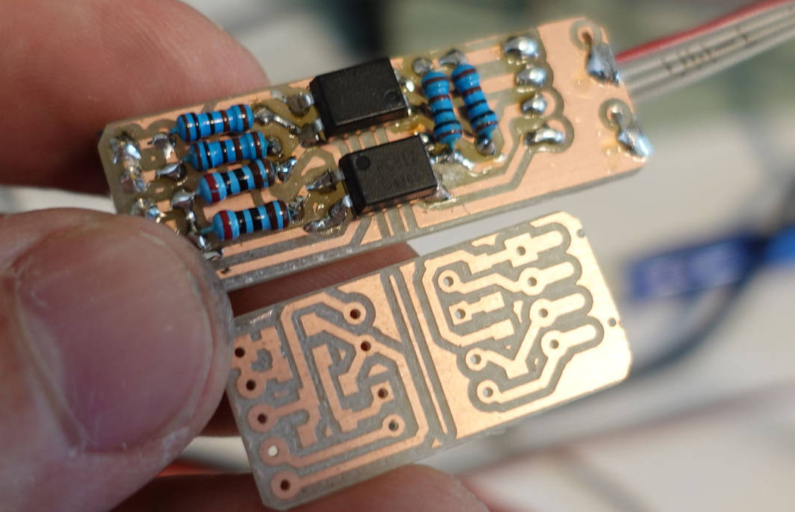

# Gerber2nc
<h1>G-code from Gerber files for PCBs</h1>
A Python script to make g-code tool paths from Gerber files for milling out simple PCBs

A relatively simple script to calculate CNC tool paths for milling out traces for a 
simple single sided PCB designed with KiCad (not tested with anything else).
  
It pops up a picture of the traces and toolpaths
for review before generating the g-code.

No "configuration" -- the parameters are all in the code.  The code IS the configuration
file, just search for "parameters" in the code if you want to change them.

The nice thing about this is if you make changes to your PCB, you can just re-run this
script to get updated g-code files.

